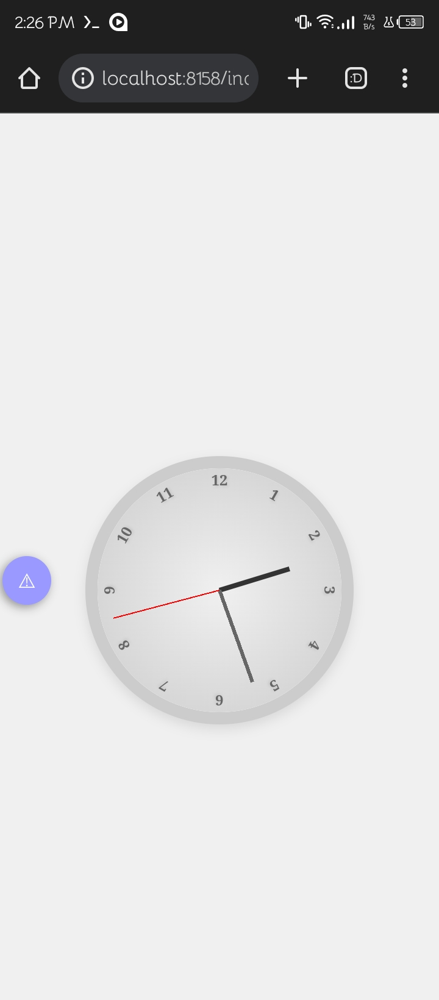

# Analog Watch Design

Welcome to the Analog Watch Design repository! This project features a simple and elegant analog watch created using HTML, CSS, and JavaScript.

## Features

- Realistic analog watch display
- Smooth second, minute, and hour hands movement
- Stylish design with customizable color schemes

## How to Use

1. Clone this repository: `git clone https://github.com/Peaky-XD/Analog-Watch.git`
2. Open `index.html` in your preferred web browser.
3. Enjoy the beauty of the analog watch!

## Contributions

Contributions are welcome! Feel free to submit pull requests, report issues, or suggest new features. Let's make this analog watch design even better together.

## Badges

## License

This project is licensed under the [MIT License](LICENSE).

---

Feel free to explore, customize, and share the analog watch design! If you find this project helpful, consider giving it a star. If you have any questions or feedback, please open an issue. Happy coding!
